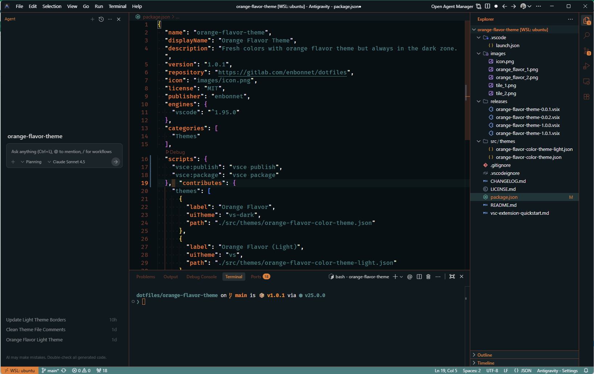

<div align="center">
  

  # Orange Flavor Theme

  <p>
    A vibrant VS Code color theme with warm orange accents and cool teal highlights.
    <br />
    Available in <b>Dark</b> and <b>Light</b> variants.
  </p>

  <p>
    <a href="https://marketplace.visualstudio.com/items?itemName=enbonnet.orange-flavor-theme">
      
    </a>
    <a href="https://open-vsx.org/extension/enBonnet/orange-flavor-theme">
      
    </a>
    <a href="https://marketplace.visualstudio.com/items?itemName=enbonnet.orange-flavor-theme">
      
    </a>
    <a href="https://marketplace.visualstudio.com/items?itemName=enbonnet.orange-flavor-theme">
      
    </a>
  </p>
</div>

---

## 📸 Screenshots

### Orange Flavor (Dark)


### Orange Flavor (Light)


---

## ✨ Features

- **Dual Themes**: Seamlessly switch between **Orange Flavor** (Dark) and **Orange Flavor (Light)**.
- **Carefully Crafted Colors**:
  - 🍊 **Primary**: Vibrant Orange (`#f47c20`) for focus.
  - 🌲 **Secondary**: Cool Teal (`#2a7f7f`) for balance.
  - 🍫 **Tertiary**: Warm Brown (`#7c3626`) for depth.
- **Complete Coverage**: Optimized for syntax highlighting, UI elements, and terminal colors.
- **Readability First**: High contrast where it matters, easy on the eyes for long coding sessions.

## 🎨 Color Palette

| Color | Hex | Usage |
|-------|-----|-------|
| **Orange** | `#f47c20` | Active tabs, highlights, keywords |
| **Teal** | `#2a7f7f` | Strings, status bar, selections |
| **Brown** | `#7c3626` | Comments, borders, line numbers |
| **Dark BG** | `#051014` | Editor background (Dark) |
| **Light BG** | `#ffffff` | Editor background (Light) |

## 🚀 Installation

### From VS Code Marketplace

1. Open **VS Code**.
2. Go to **Extensions** (`Ctrl+Shift+X` / `Cmd+Shift+X`).
3. Search for `"Orange Flavor Theme"`.
4. Click **Install**.

**Or install directly:**
- [VS Code Marketplace](https://marketplace.visualstudio.com/items?itemName=enbonnet.orange-flavor-theme)
- [Open VSX Registry](https://open-vsx.org/extension/enBonnet/orange-flavor-theme) (for VSCodium, Code-OSS, etc.)

### Activate the Theme

1. Press `Ctrl+K Ctrl+T` (Windows/Linux) or `Cmd+K Cmd+T` (macOS).
2. Choose **Orange Flavor** or **Orange Flavor (Light)**.

---

## 🛠️ Development

This theme is maintained in its own [GitHub repository](https://github.com/enBonnet/orange-flavor-theme-vscode).

### Prerequisites

Install the Visual Studio Code Extension Manager (vsce):

```bash
npm install -g @vscode/vsce
```

### Building from Source

```bash
# Clone the repository
git clone https://github.com/enBonnet/orange-flavor-theme-vscode.git
cd orange-flavor-theme-vscode

# Install dependencies
npm install

# Package the extension
vsce package
```

### Publishing

<details>
<summary>Click to expand publishing instructions</summary>

#### First-Time Setup

1. **Create a Publisher Account**: [VS Marketplace Management](https://marketplace.visualstudio.com/manage).
2. **Create a PAT**: [Azure DevOps](https://dev.azure.com) with `Marketplace -> Manage` scope.
3. **Login**: `vsce login <publisher-name>`.

#### Publishing a New Version

1. **Update Version**: Increment version in `package.json`.
2. **Publish**:
   ```bash
   vsce publish       # Publish directly
   vsce publish patch # Auto-increment patch version
   ```

</details>

## 📄 License

MIT License - See [LICENSE.md](LICENSE.md) for details.

## 💬 Feedback

Found a bug or have a suggestion? Please open an issue on the [GitHub repository](https://github.com/enBonnet/orange-flavor-theme-vscode).

## Inspiration

- Demo files and code taken from [cobalt2-vscode](https://github.com/wesbos/cobalt2-vscode) repository.

---

<div align="center">
  <b>Enjoy coding with Orange Flavor! 🍊</b>
</div>
