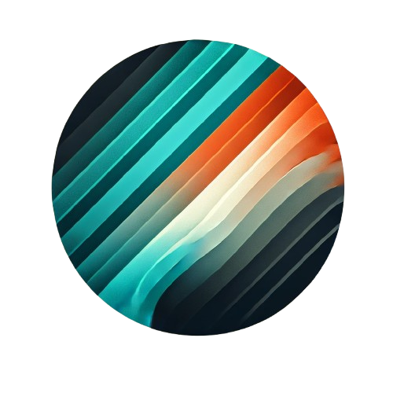
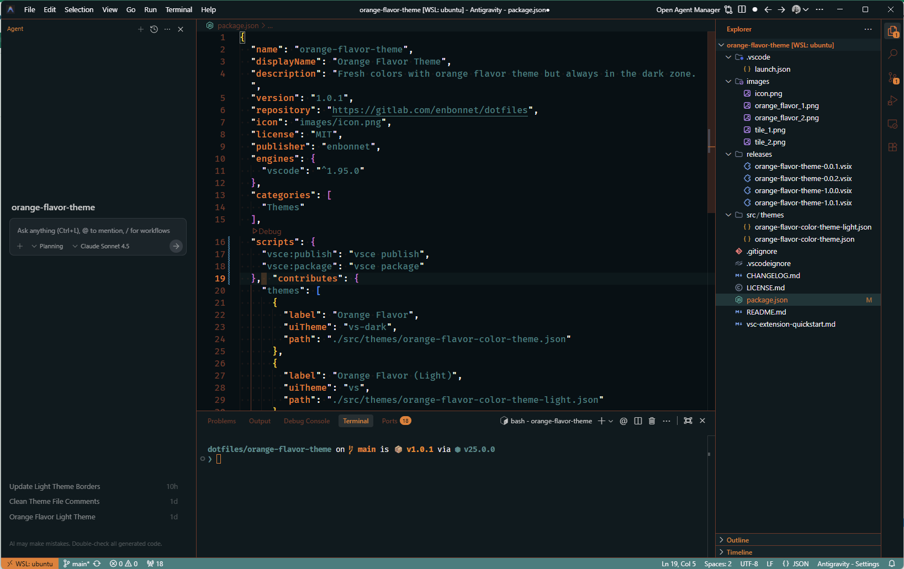
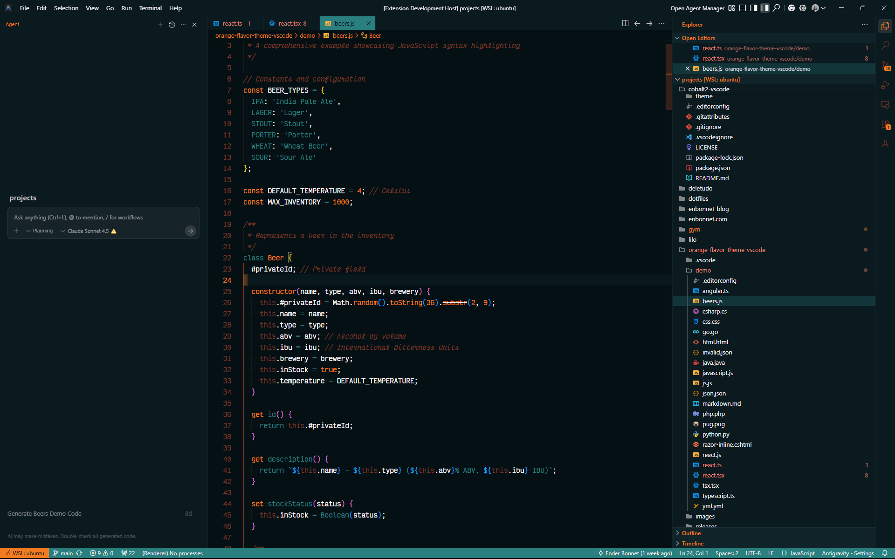
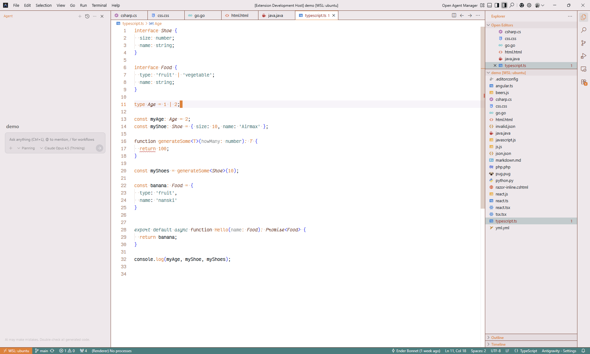
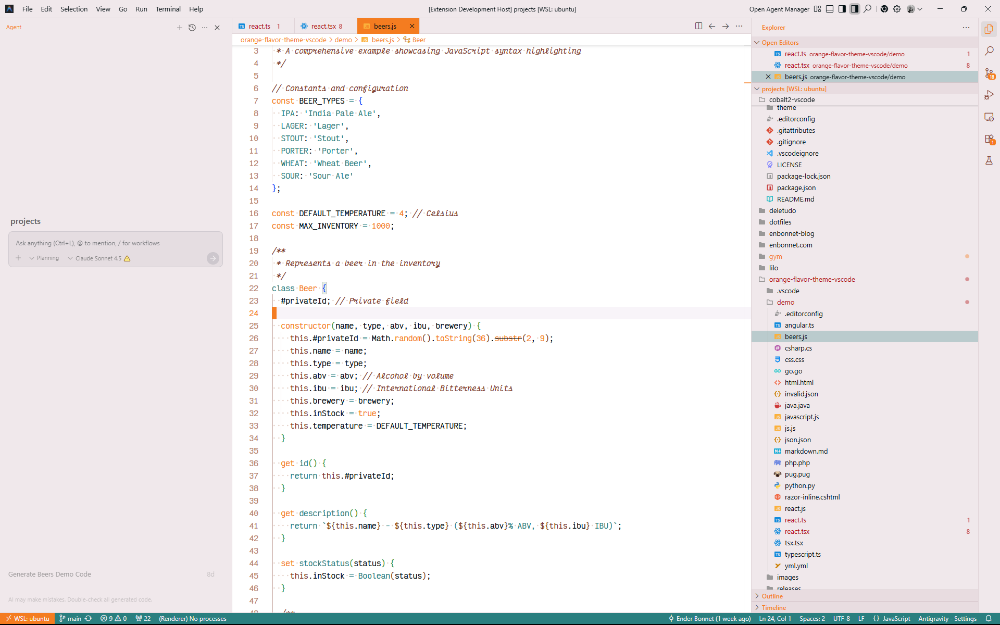

<div align="center">
  

  <h1>Orange Flavor Theme</h1>

  <p>
    <a href="https://marketplace.visualstudio.com/items?itemName=enbonnet.orange-flavor-theme">
      
    </a>
    <a href="https://open-vsx.org/extension/enBonnet/orange-flavor-theme">
      
    </a>
    <a href="https://marketplace.visualstudio.com/items?itemName=enbonnet.orange-flavor-theme">
      
    </a>
    <a href="https://marketplace.visualstudio.com/items?itemName=enbonnet.orange-flavor-theme">
      
    </a>
  </p>
</div>

## Table of Contents

- [Features](#-features)
- [Preview](#-preview)
- [Color Palette](#-color-palette)
- [UI Variants](#-ui-variants)
- [ANSI Terminal Colors](#-ansi-terminal-colors)
- [Supported Languages](#-supported-languages)
- [Installation](#-installation)
- [Using the Theme](#-using-the-theme)
- [Recommended Settings](#-recommended-settings)
- [Development](#-development)
- [Contributing](#-contributing)
- [Credits](#-credits)
- [License](#-license)

## Features

- **Four Variants** — Choose from Dark, Dark Soft, Light, and Light Soft. Dark themes use deep blue-black backgrounds; light themes use warm off-white surfaces. Soft variants use gentler, lower-contrast borders for a refined look.
- **Semantic Highlighting** — Full semantic token support for TypeScript, JavaScript, React (JSX/TSX), Python, C#, PHP, and more.
- **Carefully Crafted Palette** — Vibrant orange (`#f47c20`) as the accent, balanced by cool teal (`#2a7f7f`) and warm brown (`#7c3626`) undertones.
- **Terminal Ready** — All 16 ANSI terminal colors are set to match the theme palette.
- **Eye Comfort** — Thoughtfully tuned contrast ratios with dark backgrounds (`#051014`) and muted borders so you can code for hours without fatigue.

## Preview

<div align="center">
  <h3>Orange Flavor (Dark)</h3>
  
  
  <h3>Orange Flavor (Dark Soft)</h3>
  
  
  <h3>Orange Flavor (Light)</h3>
  
  
  <h3>Orange Flavor (Light Soft)</h3>
  
</div>

## Color Palette

| Role | Color | Hex | Preview |
|------|-------|-----|---------|
| Primary Accent | Orange | `#f47c20` |  |
| Secondary Accent | Teal | `#2a7f7f` |  |
| Tertiary Accent | Brown | `#7c3626` |  |
| Foreground (Dark) | Off-White | `#f8f4f9` |  |
| Foreground (Light) | Dark Blue-Black | `#051014` |  |
| Error | Light Red | `#ff6b6b` |  |
| Modified Tab | Bright Red | `#ff4757` |  |
| Selection (Dark) | Dark Brown | `#31150f` |  |
| Selection (Light) | Light Peach | `#f4c9be` |  |
| Keywords | Orange / Teal | — | — |
| Strings | Teal | `#2a7f7f` |  |
| Comments | Brown (italic) | `#7c3626` |  |
| Functions | Orange | `#f47c20` |  |
| Types / Interfaces | Brown (italic) | `#7c3626` |  |

## UI Variants

### Dark Theme Surface Layers

| Variable | Hex | Purpose |
|----------|-----|---------|
| Editor background | `#051014` | Main editor area |
| Sidebar / Activity Bar | `#0a1a1f` | Side panels and title bar |
| Widgets / Dropdowns | `#0f2329` | Hover widgets, inputs, dropdowns |
| Status Bar | `#2a7f7f` | Bottom status bar |
| Active Tab | `#051014` | Currently focused tab |

### Light Theme Surface Layers

| Variable | Hex | Purpose |
|----------|-----|---------|
| Editor background | `#ffffff` | Main editor area |
| Sidebar / Activity Bar | `#f0e8eb` | Side panels and title bar |
| Widgets / Dropdowns | `#e8dce0` | Hover widgets, inputs, dropdowns |
| Status Bar | `#2a7f7f` | Bottom status bar |
| Active Tab | `#ffffff` | Currently focused tab |

## ANSI Terminal Colors

| ANSI | Name | Normal | Bright |
|------|------|--------|--------|
| 0 | Black | `#051014` | `#7c3626` |
| 1 | Red | `#7c3626` | `#f47c20` |
| 2 | Green | `#2a7f7f` | `#2a7f7f` |
| 3 | Yellow | `#f47c20` | `#f8f4f9` |
| 4 | Blue | `#2a7f7f` | `#7c3626` |
| 5 | Magenta | `#7c3626` | `#f47c20` |
| 6 | Cyan | `#2a7f7f` | `#2a7f7f` |
| 7 | White | `#f8f4f9` | `#f8f4f9` |

## Supported Languages

| Language | Explicit TextMate Scoping |
|----------|--------------------------|
| CSS / Stylus | `source.css`, `source.stylus` — entities, ID selectors, constants, strings, variables, support |
| HTML | `text.html.basic` — entity names, entity attributes, script tags, string quotes, toc-list IDs |
| JavaScript | `source.js` — storage type function, variable language, type classes, inherited classes |
| TypeScript | `source.ts` — entity name types, keywords, punctuation parameters, arrow functions, return types |
| React (JSX/TSX) | `meta.jsx.children` — JSX children rendering |
| JSON | `source.json` — support properties, strings |
| Markdown | Headings, paragraphs, quotes, separators, emphasis, lists, links, inline code, fenced code blocks |
| Python | `variable.parameter.function.language.special.self.python`, `meta.function-call.generic.python`, `meta.function-call.arguments.python` |
| PHP | `source.php` — entities, variables |
| C# | `storage.type.cs`, `entity.name.variable.property.cs`, `storage.modifier.cs` |
| INI | `source.ini` — entities, keywords, punctuation separators |
| Pug / Jade | `text.jade` — entity names, attribute names, string interpolation |
| Diff | `markup.inserted`, `markup.deleted`, `meta.diff.header` |

Additional languages are covered by general-purpose scoping rules for comments, strings, keywords, constants, entities, punctuation, storage, support, and variables.

## Installation

<a href="https://marketplace.visualstudio.com/items?itemName=enbonnet.orange-flavor-theme">
  
</a>
<a href="https://open-vsx.org/extension/enBonnet/orange-flavor-theme">
  
</a>

### From VS Code

1. Open **VS Code**
2. Go to **Extensions** (`Ctrl+Shift+X` / `Cmd+Shift+X`)
3. Search for `"Orange Flavor Theme"`
4. Click **Install**

## Using the Theme

1. Open the **Command Palette** (`Ctrl+Shift+P` / `Cmd+Shift+P`)
2. Select **Preferences: Color Theme**
3. Search for `"Orange Flavor"`
4. Choose your variant:
   - **Orange Flavor** — Dark with defined borders
   - **Orange Flavor Soft** — Dark with subtle borders
   - **Orange Flavor (Light)** — Light with defined borders
   - **Orange Flavor Soft (Light)** — Light with subtle borders

## Recommended Settings

```json
{
  "workbench.colorTheme": "Orange Flavor",
  "editor.fontFamily": "'JetBrains Mono', 'Victor Mono', 'Fira Code', monospace",
  "editor.fontSize": 14,
  "editor.lineHeight": 1.6
}
```

## Development

### Prerequisites

- Node.js 18+
- npm or pnpm

### Setup

```bash
git clone https://github.com/enBonnet/orange-flavor-theme-vscode.git
cd orange-flavor-theme-vscode
npm install
npm install -g @vscode/vsce
```

### Build & Package

```bash
vsce package -o releases/
```

### Project Structure

```
orange-flavor-theme-vscode/
├── src/
│   └── themes/
│       ├── orange-flavor-color-theme.json          # Dark theme (hard borders)
│       ├── orange-flavor-color-theme-soft.json      # Dark soft theme
│       ├── orange-flavor-color-theme-light.json     # Light theme (hard borders)
│       └── orange-flavor-color-theme-soft-light.json # Light soft theme
├── demo/           # Sample files for testing
├── images/         # Icon and screenshots
├── docs/           # Static landing page
├── package.json
├── README.md
├── CHANGELOG.md
└── LICENSE.md
```

## Contributing

Found an issue or have a suggestion? Contributions are welcome! Please open an issue or submit a pull request on the [GitHub repository](https://github.com/enBonnet/orange-flavor-theme-vscode).

## Credits

Inspired by the warm orange and teal color palette. Demo files adapted from the [Cobalt2 VS Code theme](https://github.com/wesbos/cobalt2-vscode) repository.

## License

This project is licensed under the MIT License — see [LICENSE.md](LICENSE.md) for details.

---

<div align="center">
  <sub>Made by <a href="https://github.com/enBonnet">enbonnet</a></sub>
</div>
